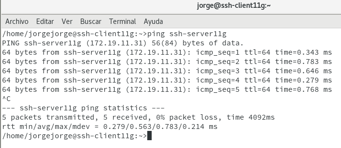
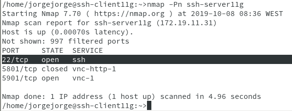
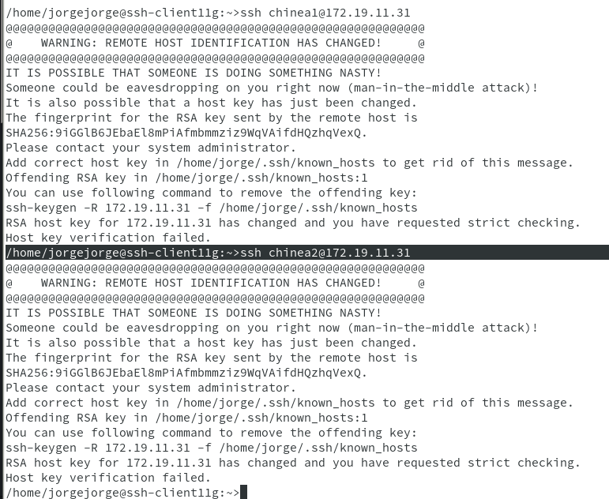
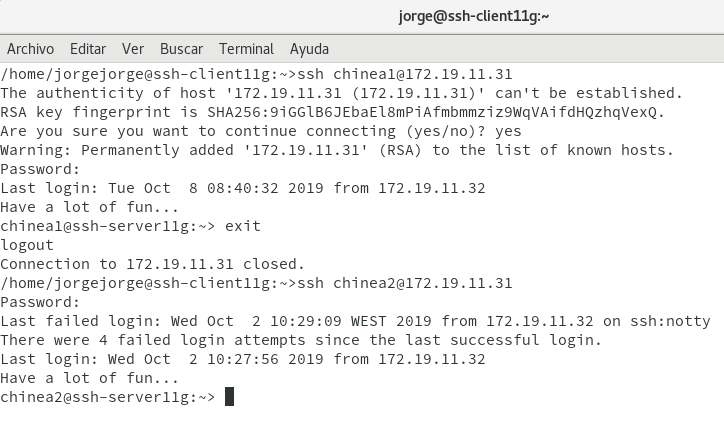
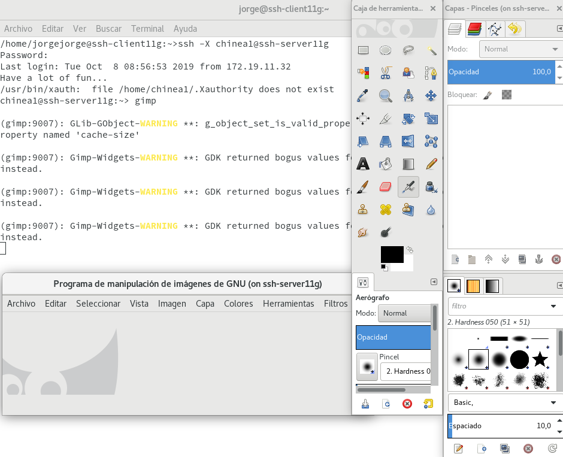
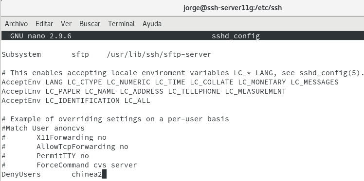

# RÚBRICA A2 ACCESO REMOTO SSH

* 2.2 Primera conexión SSH GNU/LINUX.

ping al server desde el cliente.

mostrarnos que el puerto 22 está abierto.

conexión SSH desde cada cliente usando el usuario 1er-apellido-alumno1.

volver a conectar.

comprobar fichero known_hosts.

* 3.2 Comprobar cambio clave servidor SSH.

update del known_hosts.

Volver a probar la conexión ssh.

* 5 Autentificación mediante clave pública.

copiar la clave pública con el usuario remoto alumno4.

ssh desde el cliente11g

ssh desde el cliente11w

* 6 Uso de SSH como túnel para X.

conectar via ssh al servidor y ejecutar alguna aplicación.

* 8.1 Restricción sobre un usuario.

denegamos al usuario alumno2.

comprobamos la restricción.

