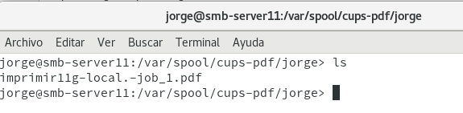

# Servidor de Impresión GNU/Linux (CUPS).

## Jorge Chinea Polegre

## Rúbruica

* Comprobar que el servicio está en ejecución.

* Comprobar que se imprime de forma local.

Listado de impresoras en CUPS.

Selección de la impresora para imprimir en local.

Registro en el directorio /var/spool/cups-pdf/nombre_de_usuario.

* Comprobar que se imprime de forma remota.

Activar compartir impresora.

Comprobar que el puerto 631 con el service ipp esta abierto.

> la máquina smb-cli11g es la remota y la smb-server11 la máquina local.

Elegimos en Yast -> Impresoras la impresora remora.

Registro de la impresión.

