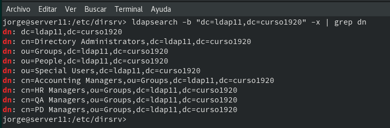

# Rúbrica Servidor 389-DS - OpenSUSE

## Unidad 4

## 2.3 Comprobar contenido DS LDAP

* ldapsearch -b "dc=ldap11,dc=curso1920" -x | grep dn , muestra el contenido de nuestra base de datos LDAP.

* ldapsearch -H ldap://localhost -b "dc=ldap11,curso1920" -W -D "cn=Directory Manager" | grep dn ,  en este caso hacemos la consulta usando usuario/clave.

## 3.3 Comprobar nuevo usuario

* ldapsearch -W -D "cn=Directory Manager" -b "dc=ldap11,dc=curso1920" "(uid= * )"

* Filtrado por los dn.

## 4.3 Comprobar los usuarios creados

* Creación de usuarios.

* Comprobación desde el cliente.

