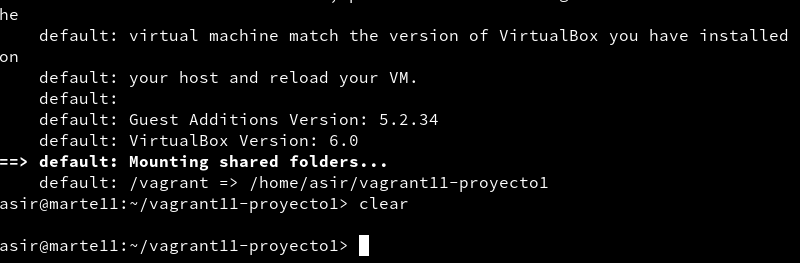

# Rúbrica u6: Vagrant con VirtualBox

## (3.3) Comprobar proyecto 1.

* vagrant box list.  Para mostrar un listado de las cajas disponibles.

* Estando dentro de la carpeta lanzamos un vagrant up.

* Comprobamos la mv en VirtualBox.

* vagrant ssh.

## (5.2) Comprobar proyecto 2.

* vagrant port.

* Comprobación con el navegador.

## (6.1) Suministro Shell Script.

* install_apache.sh.

* html/index.html.

* Vagrantfile.

* Comprobación con el navegador.

## (6.2) Suministro Puppet.

* Vagrantfile.

* mipuppet.pp.

* Comprobación packages instalados.

## (7.2) Crear Box Vagrant.

* VboxManage list vms.

* Asegurarnos de que la mv esta apagada.

* Crear caja package.box.

* Comprobar el fichero package.box.

* Añadir package.box a las cajas disponibles.

* Listado de cajas Disponibles.

* Vagrant up y vagrant ssh.

