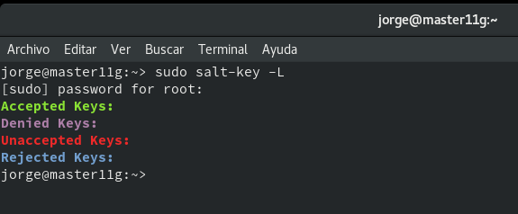
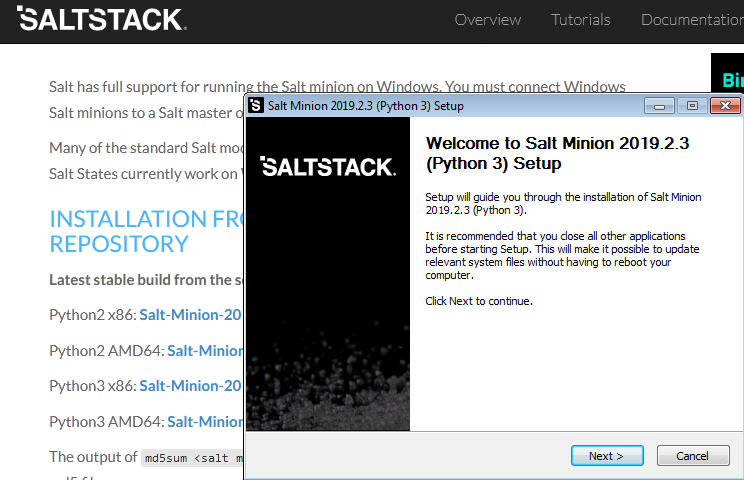
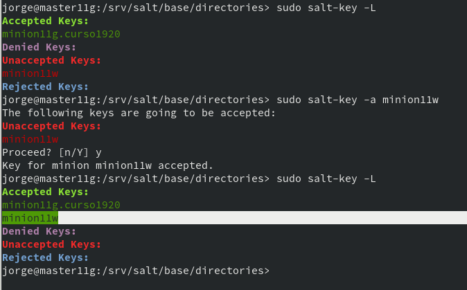

# Proyecto2 : Salt-Stack

## Preparativos.


## Master: Instalar y Configurar.

Instalar el software del master.

```
zypper install salt-Master
```


Modificar el fichero /etc/salt/master para configurar el master.


Activar el servicio con el arranque del sistema.


Iniciar el servicio.


Consultar el estado de los minions de nuestro Master



## Minion.

* Instalación y configuración.

Instalar el software del agente.

```
zypper install salt-minion
```


Modificar el archivo /etc/salt/minion para definir cual va a ser el master.


Activar el servicio del minion en el arranque y arrancar el servicio.


Comprobar si tenemos instalado un programa en el minion, por ejemplo apache2.


Vemos que apache2 no esta instalado en el minion.

* Cortafuegos.

Añadir las reglas al cortafuegos para que no bloquee la conexión de salt.


* Aceptación desde el Master.

Consulta de las peticiones en el master.


Aceptar al minion y volver a comprobar.


* Comprobar conectividad.


## Salt States

* Preparar el directorio para los estados.

Crear los directorios base y devel en la ruta /srv/salt.


Crear un archivo de configuración /etc/salt/master.d/roots.conf.


Reiniciar el servicio en el master.


* Crear nuevo estado.

Los ficheros de Salt se definen en ficheros SLS

Crear fichero /srv/salt/base/apache/init.sls:


Entendamos las definiciones:

    Nuestro nuevo estado se llama apache porque el directorio donde están las definiciones se llama srv/salt/base/apache.

    La primera línea es un identificador (ID) del estado. Por ejemplo: install_apache o apache_service, es un texto que ponemos nosotros libremente, de forma que nos ayude a identificar lo que vamos a hacer.

    pkg.installed: Es una orden de salt que asegura que los paquetes estén instalado.

    service.running: Es una orden salt que asegura de que los servicios estén iniciado o parados.


* Asociar minions a estados.

Crear /srv/salt/base/top.sls, donde asociamos a todos los Minions con el estado que acabamos de definir.


* Comprobar estados definidos.

En el master ejecutar

```
sudo salt '*' state.show_states
```


* Aplicar el nuevo estados.

Consultar los estados en detalle en el master.

```
salt '*' state.show_lowstate
```


```
salt '*' state.show_highstate
```


Aplicar nuevo estado para todos los minions.

```
salt '*' state.apply apache
```


## Crear estado "users".

Vamos a crear un estado llamado users que nos servirá para crear un grupo y usuarios en las máquinas Minions.

Crear directorio /srv/salt/base/users.


Crear fichero /srv/salt/base/users/init.sls con las definiones para crear los siguiente:

Grupo mazingerz

Usuarios kojiXX, drinfiernoXX dentro de dicho grupo.


Aplicar el estado.


Comprobación en el Minion.


```
Podemos cambiar la configuracion del estado, aplicarla y salt detectará los cambios ejecutando solo estos.
Por ejemplo añadir la opción - password: 'encripted_password' para establecer la contraseña del usuario koji11.
```
## Crear estado 'directories'

Crear la carpeta /srv/salt/base/directories y el fichero /srv/salt/base/directories/init.sts.


Aplicar el estado.


Comprobación en el Minion.


## Añadir un nuevo minion Windows.

Instalamos salt-minion en la máquina Windows.




Al terminar la instalación nos saldrá una opción para arrancar el servicio. Si no podemos abrir una consola como administrador y ejecutar sc start salt-minion.


Comprobamos las peticiones en el master.


Aceptamos la petición en el master y Comprobamos.


