# 1.Contenedores con Docker.
> Enlaces de interés
> * [Docker for beginners](http://prakhar.me/docker-curriculum/)
> * [getting-started-with-docker](http://www.linux.com/news/enterprise/systems-management/873287-getting-started-with-docker)

Esta herramienta nos permite crear "contenedores", que son aplicaciones empaquetadas auto-suficientes, muy livianas, capaces de funcionar en prácticamente cualquier ambiente, ya que tiene su propio sistema de archivos, librerías, terminal, etc.

Docker es una tecnología contenedor de aplicaciones construida sobre LXC.


# 2. Instalación y primeras pruebas

> Enlaces de interés:
> * [EN - Docker installation on SUSE](https://docs.docker.com/engine/installation/linux/SUSE)
> * [ES - Curso de Docker en vídeos](jgaitpro.com/cursos/docker/)

## 2.1 Habilitar el acceso a la red externa a los contenedores

Si queremos que nuestro contenedor tenga acceso a la red exterior, debemos activar tener activada la opción IP_FORWARD (`net.ipv4.ip_forward`). ¿Recuerdas lo que implica `forwarding` en los dispositivos de red?

* `cat /proc/sys/net/ipv4/ip_forward`, para consultar el estado de IP_FORWARD (desactivado=0, activo=1).

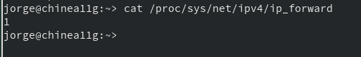

* Para activarlo podemos poner el valor 1 en el fichero de texto indicado o usar Yast.

* Reiniciar el equipo para que se aplique el cambio de configuración.


**Usar YATS para activar IP_FORWARD**

| Sistema operativo | Activar "forwarding" |
| ----------------- | -------------------- |
| OpenSUSE Leap (configuración de red es Wicked) | Yast -> Dispositivos de red -> Encaminamiento -> Habilitar reenvío IPv4 |
| Cuando la red está gestionada por Network Manager | En lugar de usar YaST debemos editar el fichero "/etc/sysconfig/SuSEfirewall2" y poner FW_ROUTE="yes" |
| OpenSUSE Tumbleweed  | Yast -> Sistema -> Configuración de red -> Menú de encaminamiento |

## 2.2 Instalación

Ejecutar como superusuario:
* `zypper in docker`, instalar docker.

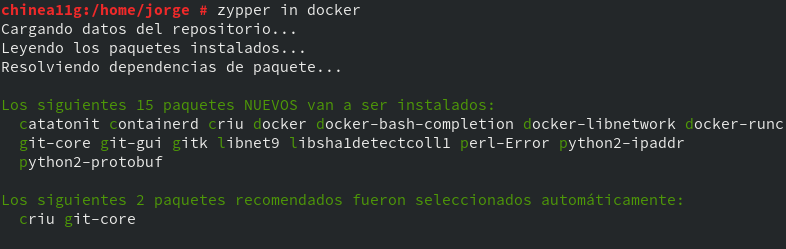

* `systemctl start docker`, iniciar el servicio. NOTA: El comando `docker daemon` hace el mismo efecto.

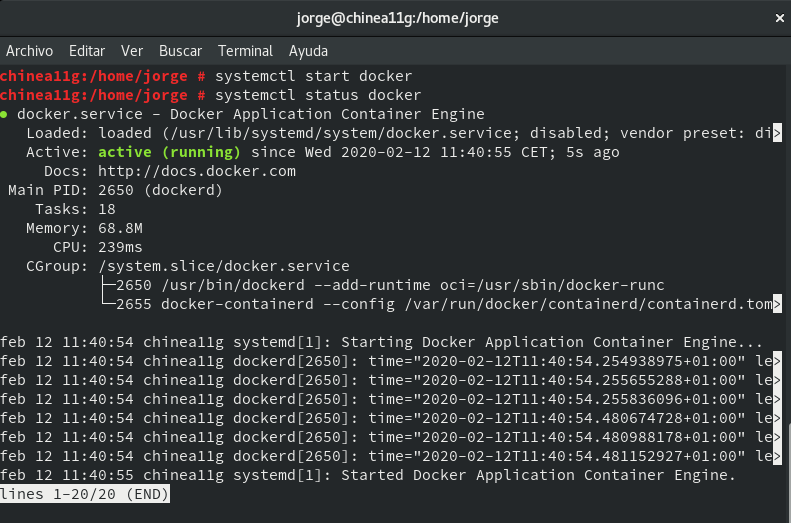

* `docker version`, comprobamos que se muestra la información de las versiones cliente y servidor.

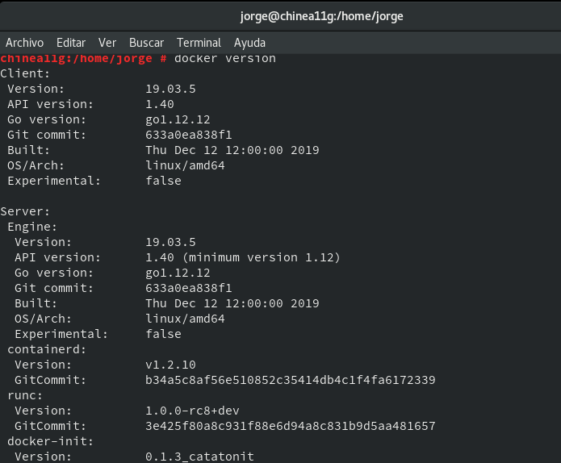

* Salir de la sesión y volver a entrar con nuestro usuario.

## 2.3 Primera prueba

* Iniciar sesión como usuario normal. Nuestro usuario debe ser miembro del grupo `docker`
* `docker images`, muestra las imágenes descargadas hasta ahora, y no debe haber ninguna.

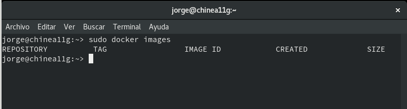

* `docker ps -a`, muestra todos los contenedores creados y no debe haber ninguno por ahora.

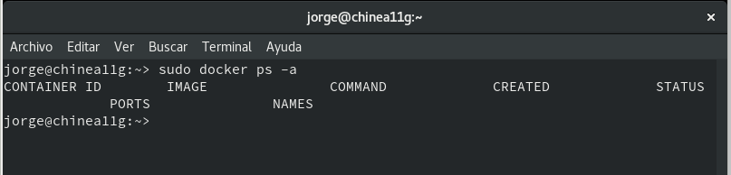

* `docker run hello-world`:
    * Descarga una imagen "hello-world"
    * Crea un contenedor
    * ejecuta la aplicación que hay dentro.

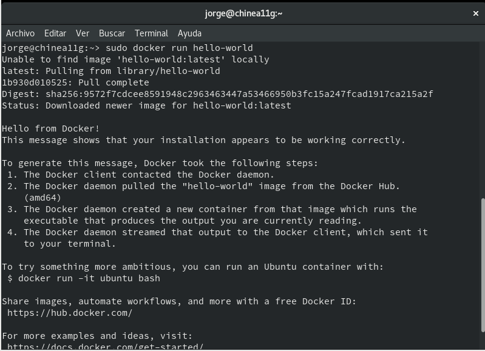

* `docker images`, ahora vemos la nueva imagen "hello-world" descargada.

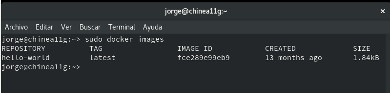

* `docker ps -a`, vemos que hay un contenedor en estado 'Exited'.

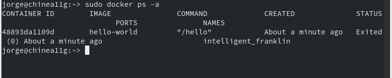

* `docker stop IDContainer`, parar el conteneder.
* `docker rm IDContainer`, eliminar el contenedor.


## 2.4 Información.

Teoría.

Tabla de referencia para no perderse:

| Software   | Base   | Sirve para crear   | Aplicaciones |
| ---------- | ------ | ------------------ | ------------ |
| VirtualBox | ISO    | Máquinas virtuales | N |
| Vagrant    | Box    | Máquinas virtuales | N |
| Docker     | Imagen | Contenedores       | 1 |


Información sobre otros comandos útiles:

| Comando                   | Descripción |
| ------------------------- | ------------------- |
| docker stop CONTAINERID   | parar un contenedor |
| docker start CONTAINERID  | iniciar un contenedor |
| docker attach CONTAINERID | conectar el terminal actual con el interior de contenedor |
| docker ps                 | mostrar los contenedores en ejecución |
| docker ps -a              | mostrar todos los contenedores (en ejecución o no) |
| docker rm CONTAINERID     | eliminar un contenedor |
| docker rmi IMAGENAME      | eliminar una imagen |


# 3. Creación manual

Nuestro SO base es OpenSUSE, pero vamos a crear un contenedor Debian,
y dentro instalaremos Nginx.

## 3.1 Crear un contendor manualmente

**Descargar una imagen**
* `docker search debian`, buscamos en los repositorios de Docker Hub contenedores con la etiqueta `debian`.

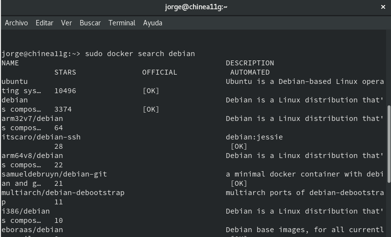

* `docker pull debian`, descargamos una imagen en local.

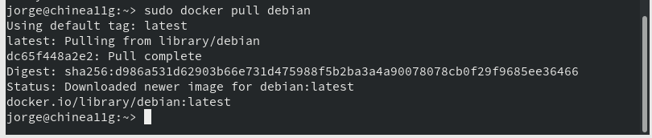

* `docker images`, comprobamos.

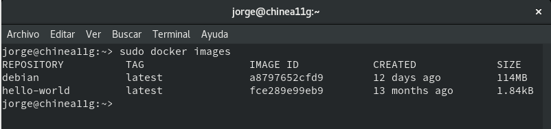


**Crear un contenedor**: Vamos a crear un contenedor con nombre `con_debian` a partir de la imagen `debian`, y ejecutaremos el programa `/bin/bash` dentro del contendor:

* `docker run --name=con_debian -i -t debian /bin/bash`

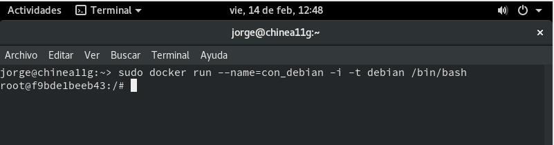

## 3.2 Personalizar el contenedor

Ahora dentro del contenedor, vamos a personalizarlo a nuestro gusto:


**Instalar aplicaciones dentro del contenedor**

```
root@IDContenedor:/# cat /etc/motd            # Comprobamos que estamos en Debian
root@IDContenedor:/# apt-get update
root@IDContenedor:/# apt-get install -y nginx # Instalamos nginx en el contenedor
root@IDContenedor:/# apt-get install -y nano  # Instalamos editor nano en el contenedor
```

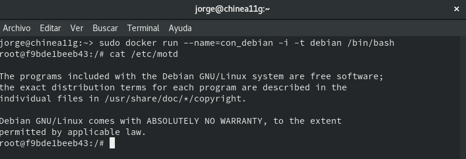

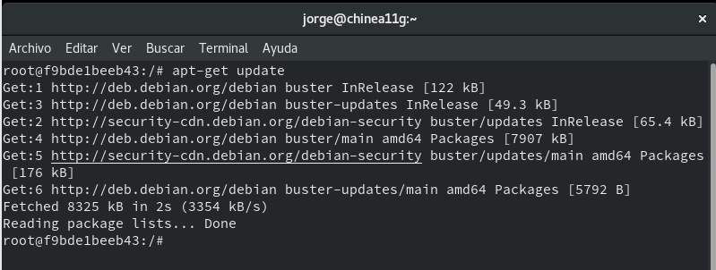

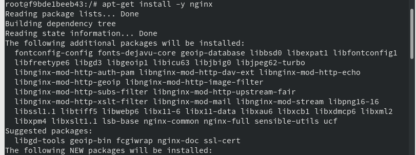

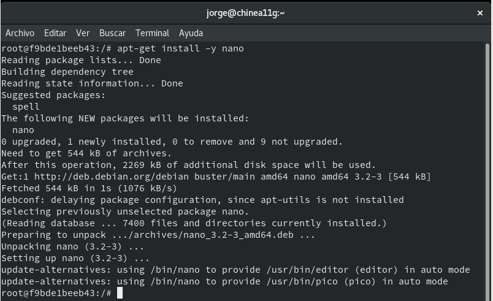


**Crear un fichero HTML** `holamundo.html`.

```
root@IDContenedor:/# echo "<p>Hola nombre-del-alumno</p>" > /var/www/html/holamundo.html
```

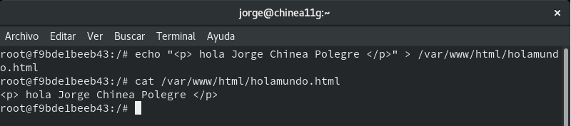

**Crear un script** `/root/server.sh` con el siguiente contenido:

```
#!/bin/bash
echo "Booting Nginx!"
/usr/sbin/nginx &

echo "Waiting..."
while(true) do
  sleep 60
done
```

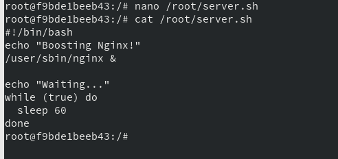

*  Permisos de ejecución al script.

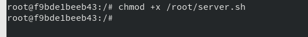

## 3.3 Crear una imagen a partir del contenedor

Ya tenemos nuestro contenedor auto-suficiente de Nginx, ahora debemos vamos a crear una nueva imagen que incluya los cambios que hemos hecho.

* Abrir otra ventana de terminal.
* `docker commit con_debian nombre-del-alumno/nginx`, a partir del CONTAINERID vamos a crear la nueva imagen que se llamará "nombre-del-alumno/nginx".

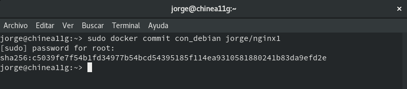

* `docker images`, comprobamos.

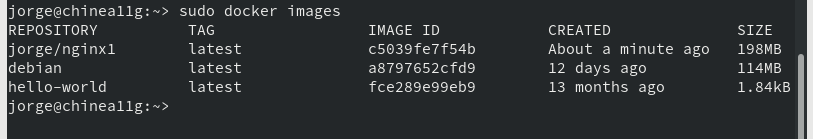

> NOTA:
> * Todo cambio que se haga en la imagen, y no se le haga commit se perderá en cuanto se cierre el contenedor.


# 4. Crear contenedor a partir de nuestra imagen

## 4.1 Crear contenedor con Nginx

Ya tenemos una imagen "dvarrui/nginx" con Nginx instalado.
* `docker run --name=con_nginx -p 80 -t dvarrui/nginx /root/server.sh`, iniciar el contenedor a partir de la imagen anterior.

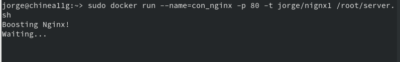

> El argumento `-p 80` le indica a Docker que debe mapear el puerto especificado del contenedor, en nuestro caso el puerto 80 es el puerto por defecto sobre el cual se levanta Nginx.

## 4.2 Buscar los puertos de salida

* Abrimos una nueva terminal.
* `docker ps`, nos muestra los contenedores en ejecución. Podemos apreciar que la última columna nos indica que el puerto 80 del contenedor está redireccionado a un puerto local `0.0.0.0.:PORT -> 80/tcp`.

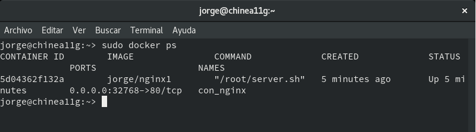

* Abrir navegador web y poner URL `0.0.0.0.:PORT`. De esta forma nos
conectaremos con el servidor Nginx que se está ejecutando dentro del contenedor.

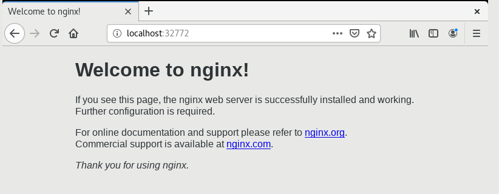

* Comprobar el acceso a `holamundo.html`.

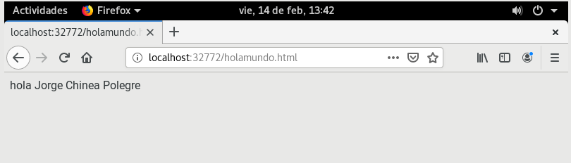

* Paramos el contenedor `con_nginx` y lo eliminamos.

Como ya tenemos una imagen docker con Nginx, podremos crear nuevos contenedores
cuando lo necesitemos.

## 4.3 Migrar la imágen a otra máquina

¿Cómo puedo llevar los contenedores Docker a un nuevo servidor?

**Exportar** imagen Docker a fichero tar:
* `docker save -o ~/alumnoXX.tar nombre-alumno/nginx1`, guardamos la imagen
"nombre-alumno/server" en un fichero tar.

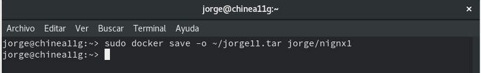

Intercambiar nuestra imagen exportada con la de un compañero de clase.

**Importar** imagen Docker desde fichero:
* Coger la imagen de un compañero de clase.

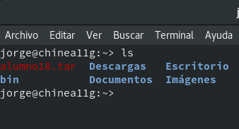

* Nos llevamos el tar a otra máquina con docker instalado, y restauramos.
* `docker load -i ~/alumnoXX.tar`, cargamos la imagen docker a partir del fichero tar.
* `docker images`, comprobamos que la nueva imagen está disponible.

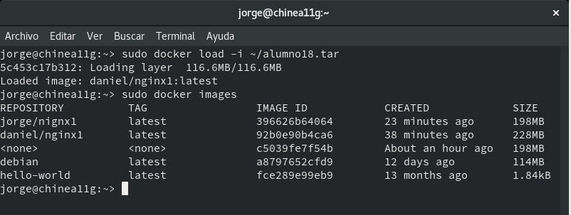

Ya podemos crear contenedores a partir de la nueva imagen.

# 5. Crear un contenedor a partir de un `Dockerfile`.

Ahora vamos a conseguir el mismo resultado del apartado anterior, pero
usando un fichero de configuración, llamado `Dockerfile`.

## 5.1 Preparar ficheros.

* Crear directorio `/home/nombre-alumno/dockerXX`.
* Entrar el directorio anterior.
* Poner copia del fichero `holamundo.html` anterior.
* Poner copia del fichero `server.sh` anterior.

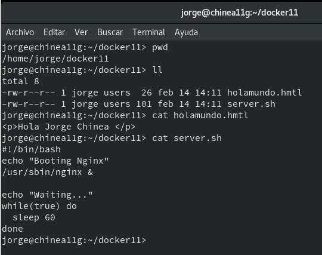

* Crear el fichero `Dockerfile` con el siguiente contenido:

```
FROM debian

MAINTAINER nombre-del-alumnoXX 1.0

RUN apt-get update
RUN apt-get install -y apt-utils
RUN apt-get install -y nginx

COPY holamundo.html /var/www/html
RUN chmod 666 /var/www/html/holamundo.html

COPY server.sh /root/server.sh
RUN chmod 755 /root/server.sh

EXPOSE 80

CMD ["/root/server.sh"]
```

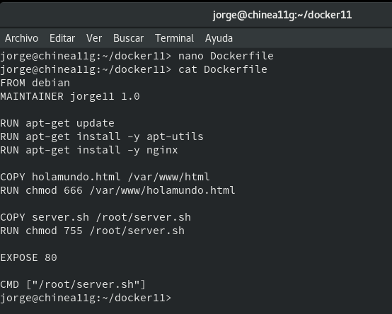

## 5.2 Crear imagen a partir del `Dockerfile`

El fichero Dockerfile contiene toda la información necesaria para construir el contenedor, veamos:

* `cd dockerXX`, entramos al directorio con el Dockerfile.
* `docker build -t nombre-alumno/server .`, construye una nueva imagen a partir del Dockerfile. OJO: el punto final es necesario.
* `docker images`, ahora debe aparecer nuestra nueva imagen.

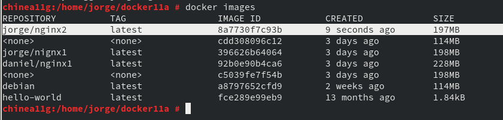

## 5.3 Crear contenedor y comprobar

A continuación vamos a crear un contenedor con el nombre app4nginx2, a partir de la imagen nombre-alumno/nginx2. Probaremos con:

 * docker run --name=app4nginx2 -p 8080:80 -t nombre-alumno/nginx2

 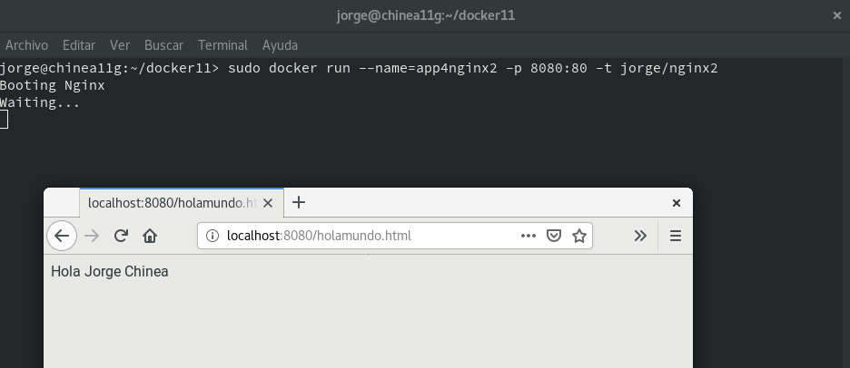

Me surgió el siguiente error en este apartado y se soluciono tras instalar las guess additions.

The command '/bin/sh -c apt-get update' returned a non-zero code: 100

Desde otra terminal:
* `docker...`, para averiguar el puerto de escucha del servidor Nginx.
* Comprobar en el navegador:
    * URL `http://localhost:PORTNUMBER`
    * URL `http://localhost:PORTNUMBER/holamundo.html`


## 5.4 Usar imágenes ya creadas

El ejemplo anterior donde creábamos una imagen Docker con Nginx se puede simplificar aún más aprovechando imágenes oficiales que ya existen.

  * Crea el directorio `dockerXXb`. Entrar al directorio.
  * Crea el siguiente `Dockerfile`

  ```
  FROM nginx

  COPY holamundo.html /usr/share/nginx/html
  RUN chmod 666 /usr/share/nginx/html/holamundo.html
  ```

  * Poner el el directorio `dockerXXb` los ficheros que se requieran para construir el contenedor.
  * `docker build -t nombre-alumno/nginx3 .`, crear la imagen.

  * `docker run --name=app5nginx3 -d -p 8080:80 nombre-alumno/nginx3`, crear contenedor.

  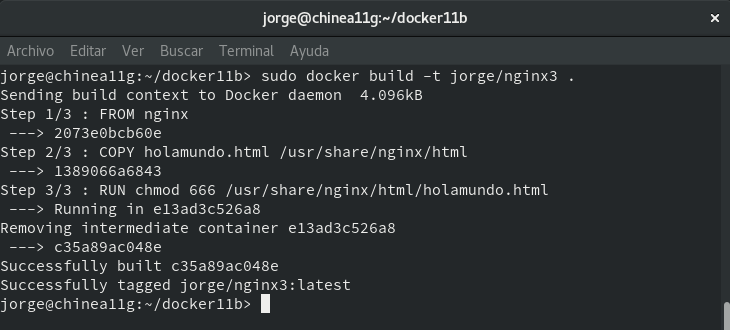

  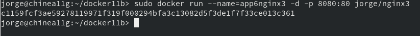

# 6. Limpiar

Cuando terminamos con los contenedores, y ya no lo necesitamos, es buena idea pararlos y/o destruirlos.
* `docker ps -a`
* `docker stop ...`

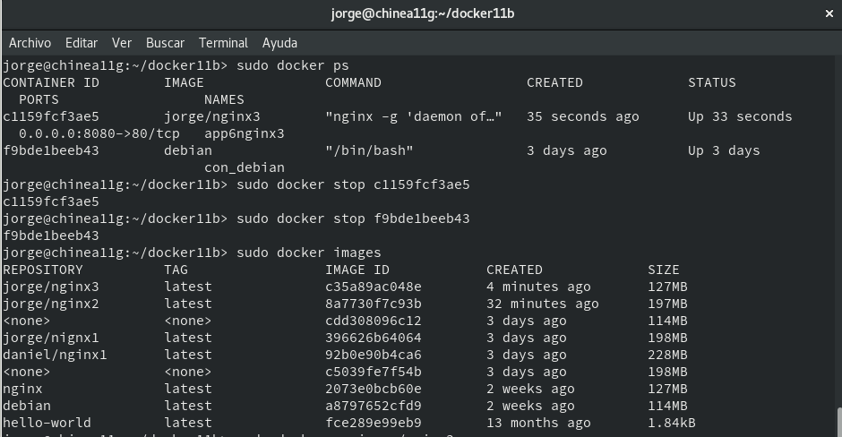

* `docker rm ...`

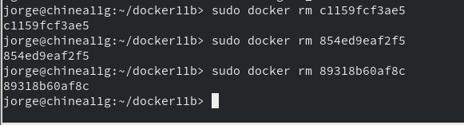

Lo mismo con las imágenes:
* `docker images`
* `docker rmi ...`

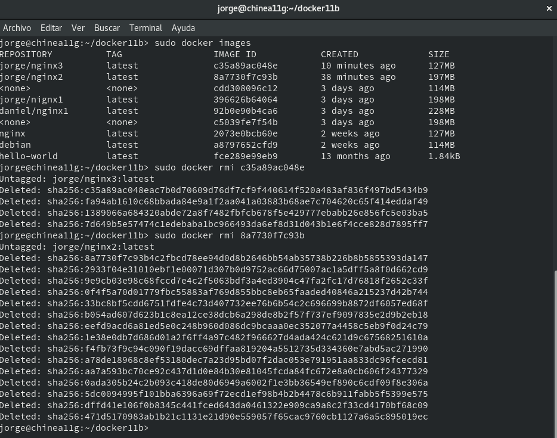
